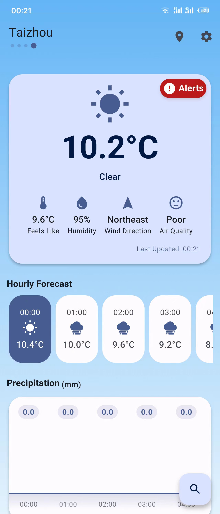
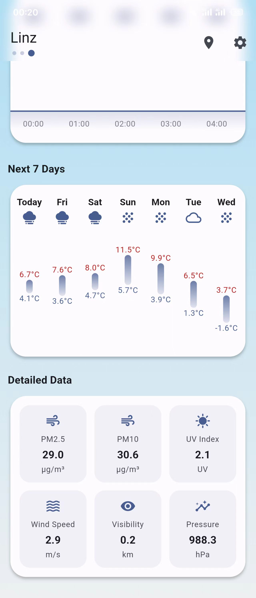
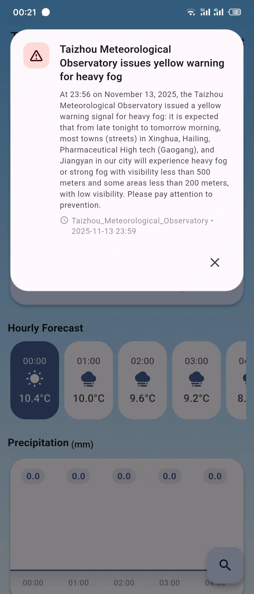
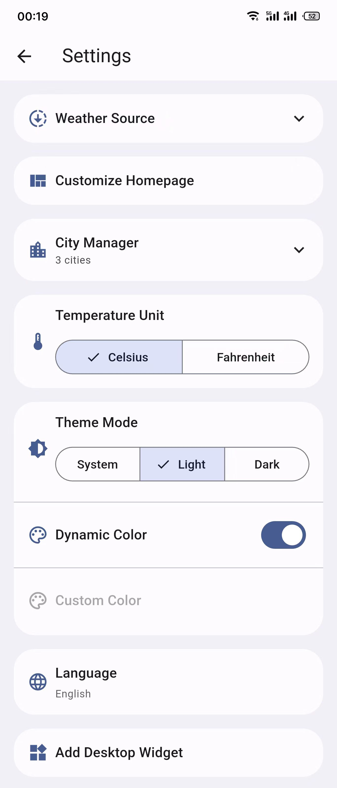
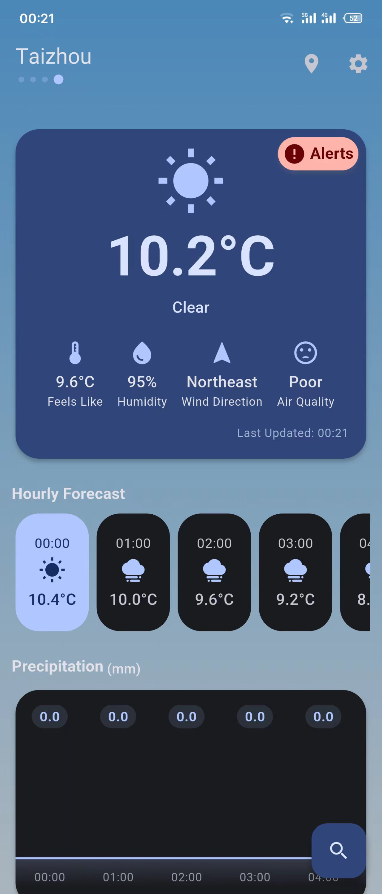
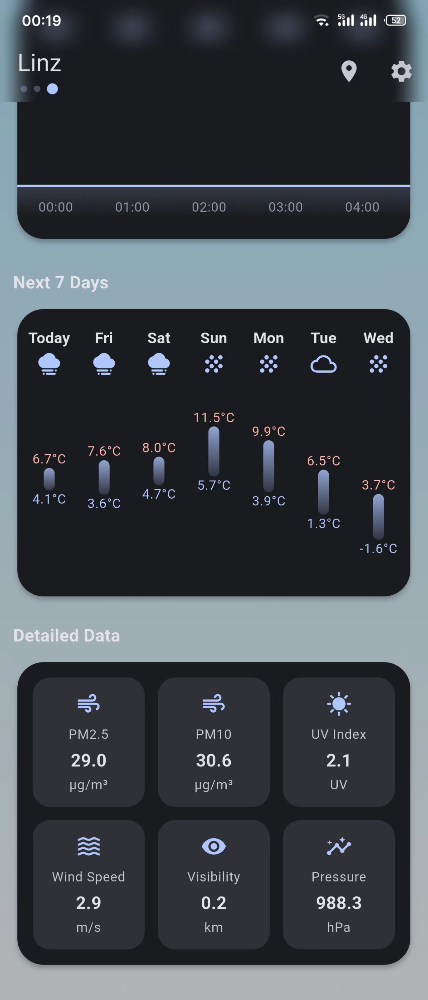
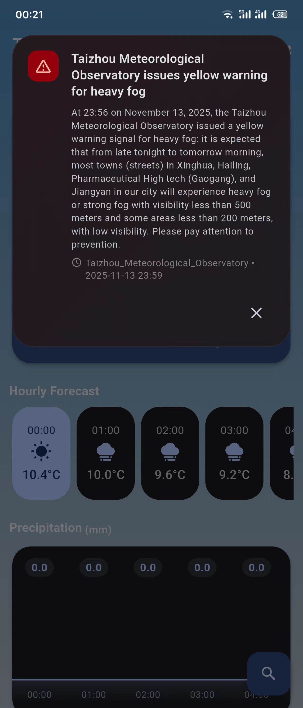
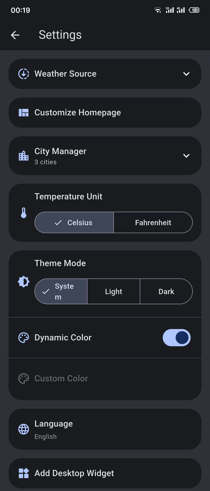

English | [简体中文](README_CN.md)

  

# Zephyr

A simple and beautiful weather app built with Flutter, powered by the OpenMeteo API, Qweather API and the search functionality is provided by the OpenStreetMap API.\
The backend is powered by the open-source [Zeus](https://github.com/LanceHuang245/Zeus), which aggregates service provider APIs and provides intelligent data caching, classification, and data transformation capabilities to deliver Zephyr services.
> **Note** 
> 
> This project is only for learning and communication use, please do not use for commercial purposes. All API interfaces have usage limits; please refrain from excessive or abusive use.
---
## Features
- Real-time weather lookup: Supports retrieving weather information for multiple cities
- Custom LLM integration: Allows users to configure their own LLM and use it to obtain weather recommendations
- Customizable weather sources: Offers users the choice between OpenMeteo API and Qweather API
- Customizable home screen layout: Users can freely show/hide components or adjust their positions
- City Management: Add, remove, or set cities as default
- 7-Day Forecast: Future weather trends at a glance
- 24-Hour Weather: Check hourly temperatures and precipitation
- Weather alerts: Real-time warnings with notifications
- Background auto-refresh: Cached data with automatic updates
- Diverse weather icons and animated backgrounds
- Theme settings: Monet color palette support
- Temperature unit switching (℃/℉)
- Multilingual localization (l10n): Simplified Chinese, Traditional Chinese, English, German, Spanish, French, Italian

## Roadmap
Visit the [Wiki](https://github.com/LanceHuang245/Zephyr/wiki) to see the features Zephyr is currently working to support.

## Usage
1. Tap the search button in the top right corner to search for a city. Select a city to return to the main screen and save it to city list, or tap the location button to get weather data of your local city
2. Manage saved cities in the settings page: set default or delete
3. Switch theme, language, and temperature unit in settings
4. Customize the main page layout in the settings page.

## Contributing
We welcome community users to contribute! Feel free to fork this repository, submit Pull Requests, and make suggestions and report bugs through Issues.

### Translation
1. The language files are located in the /lib/l10n directory.
2. You need to make a copy of `app_en.arb` and change the name of the file to the language you want to translate, e.g. `app_fr.arb`.
3. Complete the translation of the language file
4. (Mandatory) run `flutter gen-l10n` in the project root directory in a terminal and check if there are any untranslated fields in the terminal output (if there are then check `untranslated.json` and change it)
5. (Mandatory) add language in lib/core/languages.dart in the format
6. Push your code and commit [Pull Request](https://github.com/ClaretWheel1481/Zephyr/pulls)

## Download
[Zephyr Release](https://github.com/LanceHuang245/Zephyr/releases/latest) \
[Zephyr Action(Experiment)](https://github.com/LanceHuang245/Zephyr/actions/workflows/build.yml)

## Screenshots
<table>
  <tr>
    <td></td>
    <td></td>
    <td></td>
    <td></td>
  </tr>
  <tr>
    <td></td>
    <td></td>
    <td></td>
    <td></td>
  </tr>
</table>

## License
[MIT License](LICENSE) © Lance Huang